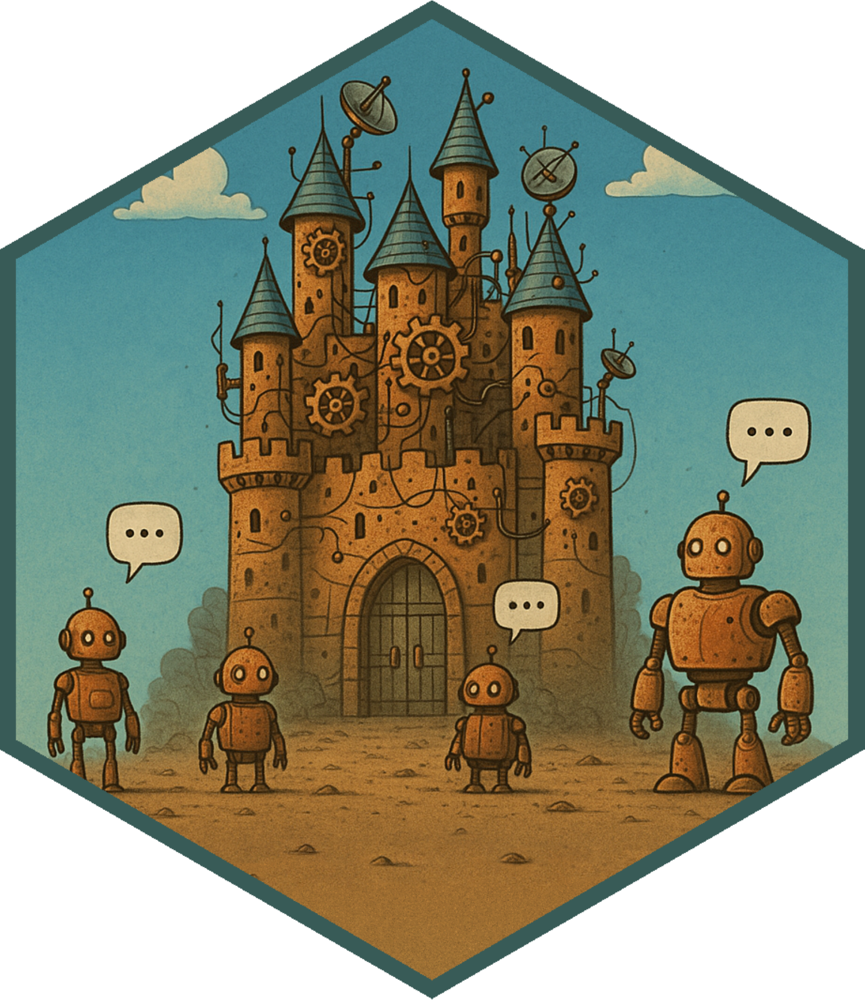

# chatalot 

[](https://CRAN.R-project.org/package=hellmer) [](https://github.com/dylanpieper/hellmer/actions/workflows/testthat.yml)

chatalot processes a lot of large language model chats in R and is an extension of [ellmer](https://ellmer.tidyverse.org).

Easily setup sequential and parallel chat processors with support for [tool calling](https://ellmer.tidyverse.org/articles/tool-calling.html), [structured data extraction](https://ellmer.tidyverse.org/articles/structured-data.html), uploaded content, save and resume, and sound notifications.

## **chatalot or ellmer?**

chatalot prioritizes safety and recovery, while ellmer prioritizes speed and cost savings.

| Priority | Function | Description |
|------------------------|------------------------|------------------------|
| 🛡️ **Safety first** | [chatalot::seq_chat()](https://dylanpieper.github.io/chatalot/reference/seq_chat.html) | Each chat saved individually in sequence |
| ⚖️ **Speed + safety** | [chatalot::future_chat()](https://dylanpieper.github.io/chatalot/reference/future_chat.html) | Each chat saved individually in parallel |
| 🚀 **Maximum speed** | [ellmer::parallel_chat()](https://ellmer.tidyverse.org/reference/parallel_chat.html) | All-or-nothing parallel processing |
| 💰 **Cost savings** | [ellmer::batch_chat()](https://ellmer.tidyverse.org/reference/batch_chat.html) | Batch APIs; \~50% cheaper with up to 24hr delays |

## Installation

You can install the development or CRAN version of the package with:

``` r
# pak::pak("dylanpieper/chatalot")
install.packages("chatalot")
```

## Setup API Keys

API keys allow access to chat models and are stored as environmental variables. I recommend `usethis` to setup API keys in your `.Renviron` such as `OPENAI_API_KEY=your-key`:

``` r
usethis::edit_r_environ(scope = c("user", "project"))
```

## Basic Usage

### Sequential Processing

Process chats in sequence, or one at a time.

``` r
library(chatalot)

chat <- seq_chat("openai/gpt-4.1", system_prompt = "Reply concisely, one sentence")

prompts <- c(
  "What roles do people have in a castle?",
  "Why are castles needed?",
  "When was the first castle built?",
  "Where are most castles located?"
)

response <- chat$process(prompts)
```

Access the responses:

``` r
response$texts()
#> [1] "In a castle, people served as rulers, warriors, administrators, 
#> craftsmen, and servants who managed its defense, governance, and daily upkeep."
#> 
#> [2] "Castles have historically been built for defense and power consolidation,
#> and today they serve as cultural landmarks that preserve our heritage 
#> and attract tourism."
#> 
#> [3] "There isn’t a definitive \"first castle,\" but the earliest structures
#> resembling castles emerged in medieval Europe around the 9th century."
#> 
#> [4] "Most castles are located in Europe, particularly in historically
#> turbulent regions like the United Kingdom, France, and Germany."     
```

### Parallel Processing

Parallel processing requests multiple chats at a time across multiple R processes using [future](https://future.futureverse.org) workers:

``` r
chat <- future_chat("openai/gpt-4.1", system_prompt = "Reply concisely, one sentence")
```

You may want to limit the number of simultaneous requests to meet a provider's rate limits by decreasing the number of parallel `workers` (default is `parallel::detectCores()`):

``` r
response <- chat$process(prompts, workers = 4)
```

## Features

### Tool Calling

Register and use [tool calling](https://ellmer.tidyverse.org/articles/tool-calling.html) to let the LLM use R functions:

``` r
weather <- data.frame(
  city = c("Chicago", "New York", "Lisbon"),
  raining = c("Heavy", "None", "Overcast"),
  temperature = c("Cool", "Hot", "Warm"),
  wind = c("Strong", "Weak", "Strong")
)

get_weather <- tool(
  function(cities) weather[weather$city %in% cities, ],
  description = "Report on weather conditions.",
  arguments = list(
    cities = type_array(type_string(), "City names")
  )
)

chat$register_tool(get_weather)

response <- chat$process(interpolate("Brief weather update for {{weather$city}}?"))

response$texts()
#> [1] "Chicago is experiencing heavy rain, cool temperatures, and strong winds."
#> [2] "New York is experiencing hot conditions with no rain and light winds."
#> [3] "In Lisbon, the weather is overcast with warm temperatures and strong winds."
```

### Structured Data Extraction

Extract [structured data](https://ellmer.tidyverse.org/articles/structured-data.html) using type specifications:

``` r
prompts <- c(
  "I go by Alex. 42 years on this planet and counting.",
  "Pleased to meet you! I'm Jamal, age 27.",
  "They call me Li Wei. Nineteen years young.",
  "Fatima here. Just celebrated my 35th birthday last week.",
  "The name's Robert - 51 years old and proud of it.",
  "Kwame here - just hit the big 5-0 this year."
)

response <- chat$process(
  prompts,
  type = type_object(
    name = type_string(),
    age = type_number()
  )
)

response$texts()
#>     name age
#> 1   Alex  42
#> 2  Jamal  27
#> 3 Li Wei  19
#> 4 Fatima  35
#> 5 Robert  51
#> 6  Kwame  50
```

### Uploaded Content

Process prompts that with text and uploaded content (e.g., [images](https://ellmer.tidyverse.org/reference/content_image_url.html) and [PDFs](https://ellmer.tidyverse.org/reference/content_pdf_file.html)):

``` r
base_prompt <- "What do you see in the image?"
img_prompts <- list(
  c(base_prompt, content_image_url("https://www.r-project.org/Rlogo.png")),
  c(base_prompt, content_image_file(system.file("httr2.png", package = "ellmer")))
)

response <- chat$process(img_prompts)

response$texts()
#> [[1]]
#> [1] "The image shows the logo for R, a programming language and software environment 
#> used for statistical computing and graphics, featuring a stylized blue \"R\" 
#> inside a gray oval or ring."

#> [[2]]
#> [1] "The image shows a logo for \"httr2\" featuring a stylized red baseball batter
#> silhouette on a dark blue hexagonal background."
```

### Save and Resume

If you interrupt chat processing (e.g., to check responses) or experience an error, you can call `process()` again to resume from the last saved chat or chunk:

``` r
response <- chat$process(prompts, file = "chat.rds")
```

If `file` is not defined, a temporary `.rds` file will be created by default.

### Sound Notifications

Toggle sound notifications on completion, interruption, and error:

``` r
response <- chat$process(prompts, beep = TRUE)
```

### Verbosity Options

By default, the chat `echo` is set to `FALSE` to show a progress bar. However, you can still configure `echo` by first setting `progress` to `FALSE`:

``` r
prompts <- c(
  "What is R?",
  "Explain base R versus tidyverse"
)

response <- chat$process(prompts, progress = FALSE, echo = TRUE)
#> R is a programming language and software environment used for 
#> statistical computing and graphics.
#> 
#> Base R consists of the core functionalities built into R, 
#> while tidyverse is a collection of packages that offer a more
#> consistent, readable, and streamlined approach to data manipulation, 
#> visualization, and analysis.
```

### Methods

-   `texts()`: Returns response texts in the same format as the input prompts (i.e., a list if prompts were provided as a list, or a character vector if prompts were provided as a vector). When a `type` is provided, returns a list with one element for each prompt. When `type` is consistent, returns a data frame with one row for each prompt, and one column for each property.
-   `chats()`: Returns a list of chat objects
-   `progress()`: Returns processing status

## Tidbits

-   Functions handle API rate limits differently:
    -   [chatalot::seq_chat()](https://dylanpieper.github.io/chatalot/reference/seq_chat.html) and [chatalot::future_chat()](https://dylanpieper.github.io/chatalot/reference/future_chat.html): Allow rate limits to be exceeded and fallback on ellmer's retry mechanism (reactive)
    -   [ellmer::parallel_chat()](https://ellmer.tidyverse.org/reference/parallel_chat.html): Throttles requests to prevent rate limits (proactive)
    -   [ellmer::batch_chat()](https://ellmer.tidyverse.org/reference/batch_chat.html): Managed by the API provider
-   [Batch and Compare the Similarity of LLM Responses in R](https://dylanpieper.github.io/blog/posts/batch-and-compare-LLM-responses.html) (Blog Post)
