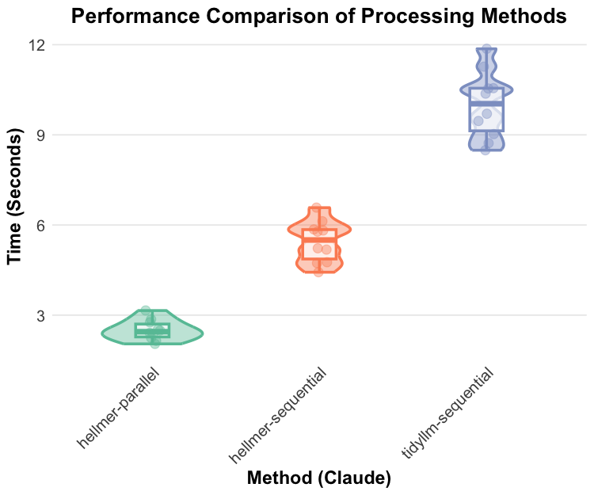

```{r, include = FALSE}
knitr::opts_chunk$set(
  collapse = TRUE,
  comment = "#>"
)
```

## Overview

This vignette compares different approaches to batching LLM operations in R. The two main packages that provide batch processing capabilities are:

-   [hellmer](https://github.com/dylanpieper/hellmer): Synchronous batch processing for any models supported by [ellmer](https://github.com/tidyverse/ellmer/)
-   [tidyllm](https://github.com/edubruell/tidyllm): Synchronous and asynchronous batch processing for a wide range of models

## Package Comparison

### hellmer

Focuses on synchronous batch processing with robust features:

```{r eval=FALSE}
library(hellmer)

chat <- chat_sequential(chat_claude, system_prompt = "Reply concisely")
result <- chat$batch(list("What is 2+2?",
                         "Name one planet.",
                         "Is water wet?",
                         "What color is the sky?"))

result$progress()
result$texts()
result$chats()
```

Key features:

-   Ellmer's [tooling](https://ellmer.tidyverse.org/articles/tool-calling.html) and [structured data extraction](https://ellmer.tidyverse.org/articles/structured-data.html)
-   State persistence and recovery
-   Progress tracking
-   Configurable output verbosity
-   Automatic retry with backoff
-   Timeout handling
-   Sound notifications

### tidyllm

Supports both synchronous and asynchronous batch processing with basic features and a side-effect-free, pipeline-oriented user interface:

```{r eval=FALSE}
library(tidyllm)

# Basic asynchronous batching
glue("Write a response to: {x}", 
     x = c(
       "What is 2+2?",
       "Name one planet.",
       "Is water wet?",
       "What color is the sky?"
     )) |>
  purrr::map(llm_message) |>
  send_batch(claude()) |>
  saveRDS("claude_batch.rds")

readRDS("claude_batch.rds") |>
  check_batch(claude())

# Synchronous batching
conversations <- c(
  "What is 2+2?",
  "Name one planet.",
  "Is water wet?",
  "What color is the sky?"
) |>
  purrr::map(~ {
    llm_message(.x) |>
      chat(claude())
  })
```

Key features:

-   Both synchronous and asynchronous processing options
-   Asynchronous processing supports Anthropic, OpenAI, Mistral, and Ollama APIs
-   Efficient parallel request queuing for Ollama
-   Status checking capabilities for async jobs
-   Cost savings (\~50% cheaper for async)

Limitations of synchronous batching:

-   No progress feedback during processing
-   No state management or recovery
-   Returns simple chat objects with no methods
-   No automatic retry or error handling
-   No timeout management

## Benchmark

When comparing the performance between the two packages and methods (n = 10), hellmer's parallel processing has the best performance.

{width="539"}

## Honorable Mentions

These packages provide batch processing capabilities for Ollama models:

### mall

[mall](https://mlverse.github.io/mall) provides synchronous batching for local Ollama models with features like row-wise dataframe processing, integrated caching, and pre-built NLP task prompts.

### rollama

[rollama](https://github.com/JBGruber/rollama) specializes in efficient batch processing for Ollama models, particularly for structured tasks like zero-shot classification.

## When to Use Each Package

-   Use [hellmer](https://github.com/dylanpieper/hellmer) for production-grade batch processing, especially for large batches or sensitive tasks
-   Use [tidyllm](https://github.com/edubruell/tidyllm) for:
    -   Cost-effective async processing
    -   Simple synchronous batching

## Performance Considerations

-   **Synchronous** ([hellmer](https://github.com/dylanpieper/hellmer)):
    -   Better for immediate feedback and structured tasks
    -   Blocks R until completion
    -   Consumes local resources
    -   Provides robust error handling and state management
-   **Asynchronous** ([tidyllm](https://github.com/edubruell/tidyllm)):
    -   Better for long-running jobs and cost savings
    -   Requires status checking
    -   Does not block R
    -   Outsources batching compute
    -   Limited error handling and state management

The choice between these approaches depends on your specific needs for error handling, state management, and execution environment. For production workflows requiring robust error handling and state management, [hellmer](https://github.com/dylanpieper/hellmer) provides the best solution. For simple batching needs or when async processing is preferred, [tidyllm](https://github.com/edubruell/tidyllm) offers a flexible alternative.
